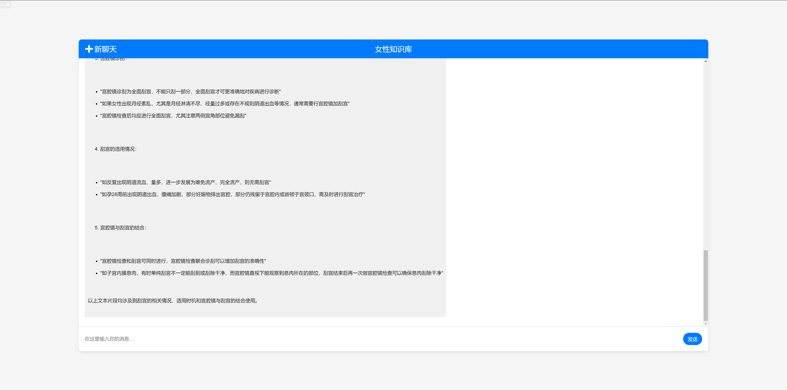

### 智谱知识库聊天应用

该项目是一个请求智谱知识库的智能聊天系统，环境配置为 JDK 17 和 Maven 3.6.6。  
以下是项目的各个功能和界面的截图介绍：

#### 1. 主页面
这是应用的主界面，用户可以在此输入并发送消息与智谱知识库进行互动。

#### 2. 发送第一条消息
用户在输入框中输入消息后点击发送按钮，消息会显示在聊天窗口中。

#### 3. 系统第一条响应
系统根据用户输入的消息返回相应的答案，答案会显示在聊天窗口中。

#### 4. 发送第二条消息
用户继续在输入框中输入第二条消息。

#### 5. 系统第二条响应
系统根据用户输入的消息返回相应的答案，答案会显示在聊天窗口中。

#### 6. 日志记录
系统会记录用户的请求和响应日志，方便调试和分析。

#### 7. 日志文件
日志记录在指定的日志文件中，用户可以查看详细的日志信息。

通过以上截图，可以直观地了解智谱知识库聊天应用的各个功能和界面。
